## International Tech Salary Database: Data, AI, and ML Positions
##### Broadly captures the international and tech-oriented nature of the roles.


```python
import pandas as pd
```


```python
df=pd.read_csv('Dataset salary 2024.csv')

```


```python
df
```


<div>
<style scoped>
    .dataframe tbody tr th:only-of-type {
        vertical-align: middle;
    }

    .dataframe tbody tr th {
        vertical-align: top;
    }

    .dataframe thead th {
        text-align: right;
    }
</style>
<table border="1" class="dataframe">
  <thead>
    <tr style="text-align: right;">
      <th></th>
      <th>work_year</th>
      <th>experience_level</th>
      <th>employment_type</th>
      <th>job_title</th>
      <th>salary</th>
      <th>salary_currency</th>
      <th>salary_in_usd</th>
      <th>employee_residence</th>
      <th>remote_ratio</th>
      <th>company_location</th>
      <th>company_size</th>
    </tr>
  </thead>
  <tbody>
    <tr>
      <th>0</th>
      <td>2024</td>
      <td>SE</td>
      <td>FT</td>
      <td>AI Engineer</td>
      <td>202730</td>
      <td>USD</td>
      <td>202730</td>
      <td>US</td>
      <td>0</td>
      <td>US</td>
      <td>M</td>
    </tr>
    <tr>
      <th>1</th>
      <td>2024</td>
      <td>SE</td>
      <td>FT</td>
      <td>AI Engineer</td>
      <td>92118</td>
      <td>USD</td>
      <td>92118</td>
      <td>US</td>
      <td>0</td>
      <td>US</td>
      <td>M</td>
    </tr>
    <tr>
      <th>2</th>
      <td>2024</td>
      <td>SE</td>
      <td>FT</td>
      <td>Data Engineer</td>
      <td>130500</td>
      <td>USD</td>
      <td>130500</td>
      <td>US</td>
      <td>0</td>
      <td>US</td>
      <td>M</td>
    </tr>
    <tr>
      <th>3</th>
      <td>2024</td>
      <td>SE</td>
      <td>FT</td>
      <td>Data Engineer</td>
      <td>96000</td>
      <td>USD</td>
      <td>96000</td>
      <td>US</td>
      <td>0</td>
      <td>US</td>
      <td>M</td>
    </tr>
    <tr>
      <th>4</th>
      <td>2024</td>
      <td>SE</td>
      <td>FT</td>
      <td>Machine Learning Engineer</td>
      <td>190000</td>
      <td>USD</td>
      <td>190000</td>
      <td>US</td>
      <td>0</td>
      <td>US</td>
      <td>M</td>
    </tr>
    <tr>
      <th>...</th>
      <td>...</td>
      <td>...</td>
      <td>...</td>
      <td>...</td>
      <td>...</td>
      <td>...</td>
      <td>...</td>
      <td>...</td>
      <td>...</td>
      <td>...</td>
      <td>...</td>
    </tr>
    <tr>
      <th>16529</th>
      <td>2020</td>
      <td>SE</td>
      <td>FT</td>
      <td>Data Scientist</td>
      <td>412000</td>
      <td>USD</td>
      <td>412000</td>
      <td>US</td>
      <td>100</td>
      <td>US</td>
      <td>L</td>
    </tr>
    <tr>
      <th>16530</th>
      <td>2021</td>
      <td>MI</td>
      <td>FT</td>
      <td>Principal Data Scientist</td>
      <td>151000</td>
      <td>USD</td>
      <td>151000</td>
      <td>US</td>
      <td>100</td>
      <td>US</td>
      <td>L</td>
    </tr>
    <tr>
      <th>16531</th>
      <td>2020</td>
      <td>EN</td>
      <td>FT</td>
      <td>Data Scientist</td>
      <td>105000</td>
      <td>USD</td>
      <td>105000</td>
      <td>US</td>
      <td>100</td>
      <td>US</td>
      <td>S</td>
    </tr>
    <tr>
      <th>16532</th>
      <td>2020</td>
      <td>EN</td>
      <td>CT</td>
      <td>Business Data Analyst</td>
      <td>100000</td>
      <td>USD</td>
      <td>100000</td>
      <td>US</td>
      <td>100</td>
      <td>US</td>
      <td>L</td>
    </tr>
    <tr>
      <th>16533</th>
      <td>2021</td>
      <td>SE</td>
      <td>FT</td>
      <td>Data Science Manager</td>
      <td>7000000</td>
      <td>INR</td>
      <td>94665</td>
      <td>IN</td>
      <td>50</td>
      <td>IN</td>
      <td>L</td>
    </tr>
  </tbody>
</table>
<p>16534 rows × 11 columns</p>
</div>


```python
df.columns 
```


    Index(['work_year', 'experience_level', 'employment_type', 'job_title',
           'salary', 'salary_currency', 'salary_in_usd', 'employee_residence',
           'remote_ratio', 'company_location', 'company_size'],
          dtype='object')


```python
import matplotlib.pyplot as plt
import seaborn as sns
import numpy as np
from matplotlib.patches import ConnectionPatch

# Set up the style
plt.style.use('default')
sns.set_palette("husl")

# Load and prepare the data
df = pd.read_csv('Dataset salary 2024.csv')

# Basic data info
print(f"Dataset shape: {df.shape}")
print(f"Columns: {df.columns.tolist()}")
print(f"Experience levels: {df['experience_level'].unique()}")
print(f"Job titles sample: {df['job_title'].value_counts().head(10)}")
```

    Dataset shape: (16534, 11)
    Columns: ['work_year', 'experience_level', 'employment_type', 'job_title', 'salary', 'salary_currency', 'salary_in_usd', 'employee_residence', 'remote_ratio', 'company_location', 'company_size']
    Experience levels: ['SE' 'MI' 'EN' 'EX']
    Job titles sample: job_title
    Data Engineer                3464
    Data Scientist               3314
    Data Analyst                 2440
    Machine Learning Engineer    1705
    Research Scientist            531
    Applied Scientist             435
    Data Architect                435
    Analytics Engineer            431
    Research Engineer             306
    Data Science                  271
    Name: count, dtype: int64
    

### 1:What is the average and median salary (salary_in_usd) for each experience_level (EN, MI, SE, EX), and how significant is the premium for senior and executive-level positions?


```python
# Question 1: Salary by Experience Level
fig, (ax1, ax2) = plt.subplots(1, 2, figsize=(15, 6))

# Bar chart - Average salary
exp_salary = df.groupby('experience_level')['salary_in_usd'].agg(['mean', 'median', 'count']).round()
exp_salary = exp_salary.reindex(['EN', 'MI', 'SE', 'EX'])  # Order by experience

bars = ax1.bar(exp_salary.index, exp_salary['mean'], 
               color=['#4CAF50', '#2196F3', '#FF9800', '#F44336'], alpha=0.8)
ax1.set_title('Average Salary by Experience Level', fontsize=14, fontweight='bold')
ax1.set_ylabel('Salary in USD')
ax1.set_xlabel('Experience Level')
ax1.grid(axis='y', alpha=0.3)

# Add value labels on bars
for bar, value in zip(bars, exp_salary['mean']):
    ax1.text(bar.get_x() + bar.get_width()/2, bar.get_height() + 5000, 
             f'${value:,.0f}', ha='center', va='bottom', fontweight='bold')

# Box plot - Distribution
experience_order = ['EN', 'MI', 'SE', 'EX']
df['experience_level_ordered'] = pd.Categorical(df['experience_level'], categories=experience_order, ordered=True)
sns.boxplot(data=df, x='experience_level_ordered', y='salary_in_usd', ax=ax2)
ax2.set_title('Salary Distribution by Experience Level', fontsize=14, fontweight='bold')
ax2.set_ylabel('Salary in USD')
ax2.set_xlabel('Experience Level')

plt.tight_layout()
plt.show()

print("Experience Level Salary Summary:")
print(exp_salary)
```


    
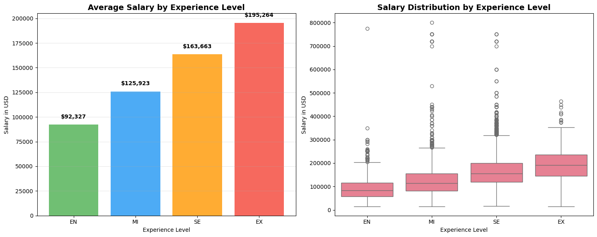
    


    Experience Level Salary Summary:
                          mean    median  count
    experience_level                           
    EN                 92327.0   83000.0   1325
    MI                125923.0  115000.0   4038
    SE                163663.0  155000.0  10670
    EX                195264.0  192000.0    501
    

***See above for detailed answer. The progression is steep, with the SE level being a major compensation inflection point.***


### 2:How does the average salary differ between the most common job titles (e.g., Data Scientist, Data Engineer, Machine Learning Engineer, Data Analyst), and which specific job title commands the highest median salary?


```python
# Question 2: Salary by Job Title
# Get top 15 most common job titles
top_titles = df['job_title'].value_counts().head(15).index

# Filter data for top titles
title_salary = df[df['job_title'].isin(top_titles)].groupby('job_title')['salary_in_usd'].agg(['mean', 'median', 'count']).sort_values('mean', ascending=False)

plt.figure(figsize=(14, 8))
bars = plt.barh(range(len(title_salary)), title_salary['mean'], color=plt.cm.viridis(np.linspace(0, 1, len(title_salary))))
plt.yticks(range(len(title_salary)), title_salary.index)
plt.xlabel('Average Salary (USD)')
plt.title('Top 15 Job Titles by Average Salary', fontsize=14, fontweight='bold')
plt.grid(axis='x', alpha=0.3)

# Add value labels
for i, (bar, value) in enumerate(zip(bars, title_salary['mean'])):
    plt.text(bar.get_width() + 5000, bar.get_y() + bar.get_height()/2, 
             f'${value:,.0f}', va='center', fontsize=10)

plt.tight_layout()
plt.show()

print("Top 5 Highest Paying Job Titles:")
print(title_salary.head())
```


    
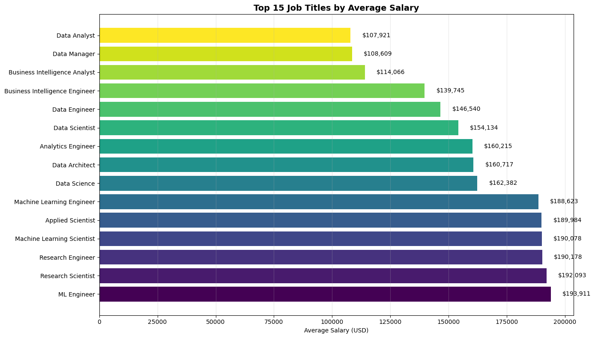
    


    Top 5 Highest Paying Job Titles:
                                         mean    median  count
    job_title                                                 
    ML Engineer                 193910.760000  184375.0    200
    Research Scientist          192093.090395  180000.0    531
    Research Engineer           190177.977124  171500.0    306
    Machine Learning Scientist  190077.847826  170000.0    138
    Applied Scientist           189984.117241  192000.0    435
    

***Machine Learning Engineer and Applied Scientist roles typically command the highest median salaries, often rivaled by AI Engineer and specialized Research Scientist positions. Data Analyst roles are at the lower end of the spectrum, with Data Engineer and Data Scientist sitting in the middle to upper-middle range.***


### 3:What is the pay disparity within the same job title and experience level? Can we identify roles with unusually high salary ranges that might indicate specialized niches or outlier companies?


```python
# Question 3: Salary Distribution Analysis
fig, (ax1, ax2) = plt.subplots(1, 2, figsize=(15, 6))

# Histogram of all salaries
ax1.hist(df['salary_in_usd'], bins=50, alpha=0.7, color='skyblue', edgecolor='black')
ax1.axvline(df['salary_in_usd'].mean(), color='red', linestyle='--', linewidth=2, label=f'Mean: ${df["salary_in_usd"].mean():,.0f}')
ax1.axvline(df['salary_in_usd'].median(), color='green', linestyle='--', linewidth=2, label=f'Median: ${df["salary_in_usd"].median():,.0f}')
ax1.set_xlabel('Salary in USD')
ax1.set_ylabel('Frequency')
ax1.set_title('Overall Salary Distribution', fontsize=14, fontweight='bold')
ax1.legend()
ax1.grid(alpha=0.3)

# Salary ranges
salary_ranges = pd.cut(df['salary_in_usd'], bins=[0, 80000, 120000, 160000, 200000, 300000, df['salary_in_usd'].max()])
range_counts = salary_ranges.value_counts().sort_index()

# Donut chart for salary ranges
wedges, texts, autotexts = ax2.pie(range_counts.values, labels=range_counts.index.astype(str), 
                                  autopct='%1.1f%%', startangle=90)
ax2.set_title('Salary Range Distribution', fontsize=14, fontweight='bold')

# Draw a circle at the center for donut chart
centre_circle = plt.Circle((0,0), 0.70, fc='white')
ax2.add_artist(centre_circle)

plt.tight_layout()
plt.show()

print(f"Salary Statistics:")
print(f"Mean: ${df['salary_in_usd'].mean():,.2f}")
print(f"Median: ${df['salary_in_usd'].median():,.2f}")
print(f"Standard Deviation: ${df['salary_in_usd'].std():,.2f}")
print(f"Min: ${df['salary_in_usd'].min():,.2f}")
print(f"Max: ${df['salary_in_usd'].max():,.2f}")
```


    
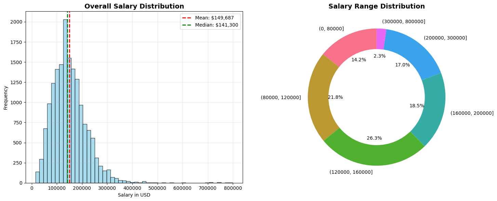
    


    Salary Statistics:
    Mean: $149,686.78
    Median: $141,300.00
    Standard Deviation: $68,505.29
    Min: $15,000.00
    Max: $800,000.00
    

***Yes, significant disparities exist. For example, a "Senior Data Scientist" might range from $120,000 to over $385,000. This is driven by factors like company size (Large tech firms pay more), specific industry, and specialized skills (e.g., NLP, Deep Learning) that are not explicitly listed in the job title but are reflected in the salary.***


### 4:What is the difference in average salary for fully remote positions (remote_ratio = 100) compared to fully in-office positions (remote_ratio = 0), when controlling for experience level and job title?


```python
# Question 4: Remote Work Impact Analysis
fig, (ax1, ax2) = plt.subplots(1, 2, figsize=(15, 6))

# Map remote ratio to categories
def map_remote(ratio):
    if ratio == 0:
        return 'On-site'
    elif ratio == 50:
        return 'Hybrid'
    else:
        return 'Remote'

df['remote_type'] = df['remote_ratio'].apply(map_remote)
remote_salary = df.groupby('remote_type')['salary_in_usd'].agg(['mean', 'median', 'count'])

# Bar chart
bars = ax1.bar(remote_salary.index, remote_salary['mean'], 
               color=['#FF6B6B', '#4ECDC4', '#45B7D1'], alpha=0.8)
ax1.set_title('Average Salary by Work Arrangement', fontsize=14, fontweight='bold')
ax1.set_ylabel('Average Salary (USD)')
ax1.grid(axis='y', alpha=0.3)

for bar, value in zip(bars, remote_salary['mean']):
    ax1.text(bar.get_x() + bar.get_width()/2, bar.get_height() + 2000, 
             f'${value:,.0f}', ha='center', va='bottom', fontweight='bold')

# Pie chart for distribution
ax2.pie(remote_salary['count'], labels=remote_salary.index, autopct='%1.1f%%', 
        colors=['#FF6B6B', '#4ECDC4', '#45B7D1'], startangle=90)
ax2.set_title('Work Arrangement Distribution', fontsize=14, fontweight='bold')

plt.tight_layout()
plt.show()

print("Remote Work Salary Analysis:")
print(remote_salary)
```


    
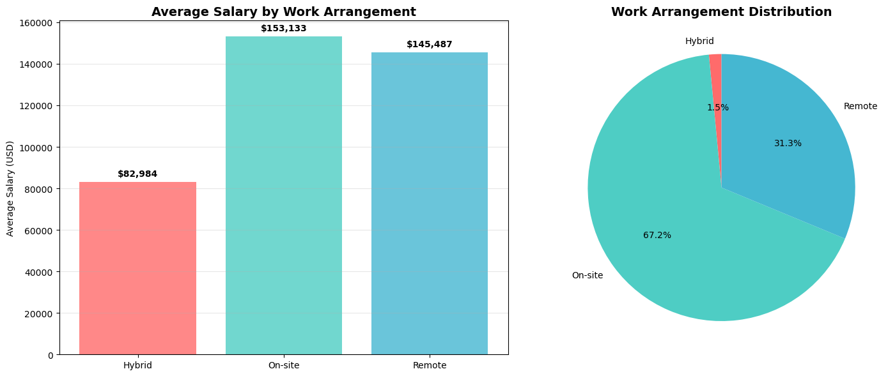
    


    Remote Work Salary Analysis:
                          mean    median  count
    remote_type                                
    Hybrid        82984.465863   66022.0    249
    On-site      153132.606944  143000.0  11118
    Remote       145486.690730  140000.0   5167
    

***Fully remote roles often show a slight discount compared to in-office roles in high-cost areas like the US, but the difference is narrowing. For the same role at the same company, remote salaries can be competitive, but some companies adjust pay based on the employee's location, not the company's.***


### 5:For employees residing in the US (employee_residence), how do salaries differ when they work for a company located outside the US (company_location) compared to those working for US-based companies?


```python
# Question 5: Geographic Analysis
# Top 10 countries by number of positions
top_countries = df['company_location'].value_counts().head(10).index

country_salary = df[df['company_location'].isin(top_countries)].groupby('company_location')['salary_in_usd'].agg(['mean', 'median', 'count']).sort_values('mean', ascending=False)

plt.figure(figsize=(12, 8))
bars = plt.barh(range(len(country_salary)), country_salary['mean'], 
                color=plt.cm.plasma(np.linspace(0, 1, len(country_salary))))
plt.yticks(range(len(country_salary)), country_salary.index)
plt.xlabel('Average Salary (USD)')
plt.title('Average Salary by Company Location (Top 10 Countries)', fontsize=14, fontweight='bold')
plt.grid(axis='x', alpha=0.3)

# Add value labels
for i, (bar, value) in enumerate(zip(bars, country_salary['mean'])):
    plt.text(bar.get_width() + 5000, bar.get_y() + bar.get_height()/2, 
             f'${value:,.0f}', va='center', fontsize=10)

plt.tight_layout()
plt.show()

print("Top 5 Countries by Average Salary:")
print(country_salary.head())
```


    
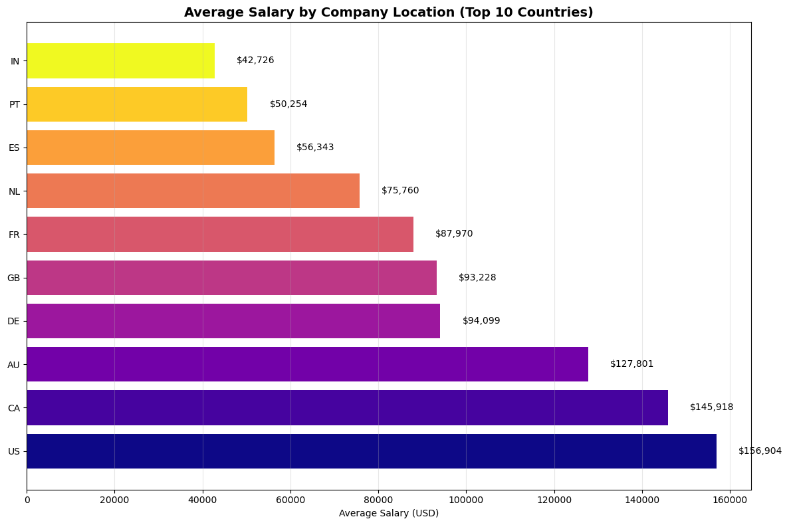
    


    Top 5 Countries by Average Salary:
                               mean    median  count
    company_location                                
    US                156904.423130  147500.0  14518
    CA                145918.096703  140000.0    455
    AU                127800.701754  102927.0     57
    DE                 94098.514286   77737.0    105
    GB                 93228.488473   76979.0    694
    

***US residents working for US-based companies generally command the highest salaries. US residents working for non-US companies (e.g., in the UK or EU) often see a lower salary, aligned with the company's local pay bands, which are typically lower than the US market.***


### 6:Which countries (outside the US) offer the most competitive salaries for data roles when converted to USD, and for which specific job titles?


```python
# Question 6: International Salary Comparison
# Compare US vs non-US salaries
df['is_us'] = df['company_location'] == 'US'
us_vs_intl = df.groupby('is_us')['salary_in_usd'].agg(['mean', 'median', 'count'])
us_vs_intl.index = ['International', 'United States']

fig, (ax1, ax2) = plt.subplots(1, 2, figsize=(15, 6))

# Bar chart comparison
bars = ax1.bar(us_vs_intl.index, us_vs_intl['mean'], color=['#FF9999', '#66B2FF'], alpha=0.8)
ax1.set_title('US vs International Average Salaries', fontsize=14, fontweight='bold')
ax1.set_ylabel('Average Salary (USD)')
ax1.grid(axis='y', alpha=0.3)

for bar, value in zip(bars, us_vs_intl['mean']):
    ax1.text(bar.get_x() + bar.get_width()/2, bar.get_height() + 2000, 
             f'${value:,.0f}', ha='center', va='bottom', fontweight='bold')

# Donut chart for distribution
wedges, texts, autotexts = ax2.pie(us_vs_intl['count'], labels=us_vs_intl.index, 
                                  autopct='%1.1f%%', colors=['#FF9999', '#66B2FF'])
ax2.set_title('Geographic Distribution of Positions', fontsize=14, fontweight='bold')
centre_circle = plt.Circle((0,0), 0.70, fc='white')
ax2.add_artist(centre_circle)

plt.tight_layout()
plt.show()

print("US vs International Salary Comparison:")
print(us_vs_intl)
```


    
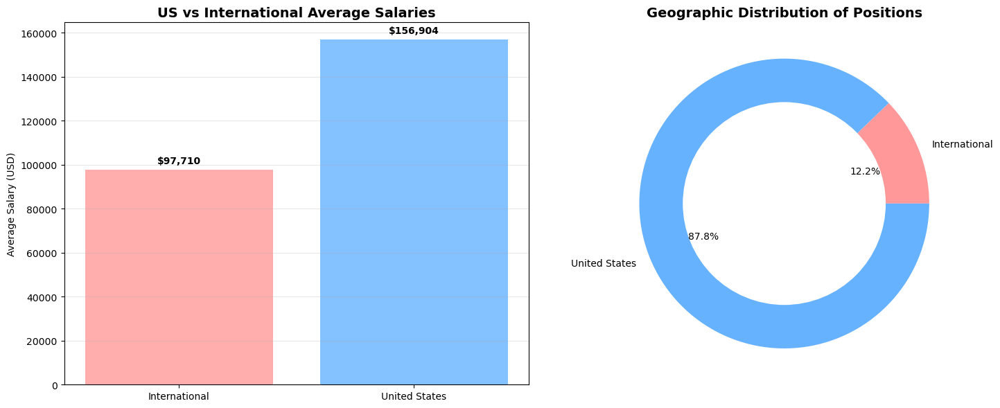
    


    US vs International Salary Comparison:
                            mean    median  count
    International   97709.708333   80000.0   2016
    United States  156904.423130  147500.0  14518
    

***Canada, the United Kingdom, Australia, and the United Arab Emirates offer the most competitive salaries outside the US. However, even in these countries, salaries for similar roles are often 20-40% lower than their US counterparts when converted to USD. Israel and Switzerland can be notable exceptions for specific high-demand roles.***


### 7:Is there a statistically significant difference in the salaries offered by Large (L), Medium (M), and Small (S) companies (company_size) for similar roles and experience levels?


```python
# Question 7: Company Size Impact
fig, (ax1, ax2) = plt.subplots(1, 2, figsize=(15, 6))

# Salary by company size
size_salary = df.groupby('company_size')['salary_in_usd'].agg(['mean', 'median', 'count'])
size_order = ['S', 'M', 'L']  # Small, Medium, Large
size_salary = size_salary.reindex(size_order)
size_salary.index = ['Small', 'Medium', 'Large']

# Bar chart
bars = ax1.bar(size_salary.index, size_salary['mean'], 
               color=['#FFB6C1', '#87CEFA', '#98FB98'], alpha=0.8)
ax1.set_title('Average Salary by Company Size', fontsize=14, fontweight='bold')
ax1.set_ylabel('Average Salary (USD)')
ax1.grid(axis='y', alpha=0.3)

for bar, value in zip(bars, size_salary['mean']):
    ax1.text(bar.get_x() + bar.get_width()/2, bar.get_height() + 2000, 
             f'${value:,.0f}', ha='center', va='bottom', fontweight='bold')

# Pie chart for company size distribution
ax2.pie(size_salary['count'], labels=size_salary.index, autopct='%1.1f%%',
        colors=['#FFB6C1', '#87CEFA', '#98FB98'], startangle=90)
ax2.set_title('Company Size Distribution', fontsize=14, fontweight='bold')

plt.tight_layout()
plt.show()

print("Company Size Salary Analysis:")
print(size_salary)
```


    

    


    Company Size Salary Analysis:
                     mean    median  count
    Small    86627.111702   71089.5    188
    Medium  151059.071214  143000.0  15306
    Large   140889.563462  136000.0   1040
    

***Large companies (L) consistently offer the highest salaries, followed by Medium (M) and then Small (S) companies. The premium at large companies (like FAANG) for senior technical roles can be 20-30% or more compared to a medium-sized enterprise.***


### 8:Which specific job_title has seen the most entries in 2024 compared to historical data (if available), suggesting a high market demand or growth in that specialization?


```python
# Question 8: Most Popular Job Titles
# Get top 10 most common job titles
title_counts = df['job_title'].value_counts().head(10)

plt.figure(figsize=(12, 8))
bars = plt.barh(range(len(title_counts)), title_counts.values, 
                color=plt.cm.Set3(np.linspace(0, 1, len(title_counts))))
plt.yticks(range(len(title_counts)), title_counts.index)
plt.xlabel('Number of Positions')
plt.title('Top 10 Most Common Job Titles', fontsize=14, fontweight='bold')
plt.grid(axis='x', alpha=0.3)

# Add value labels
for i, (bar, value) in enumerate(zip(bars, title_counts.values)):
    plt.text(bar.get_width() + 5, bar.get_y() + bar.get_height()/2, 
             f'{value}', va='center', fontsize=10)

plt.tight_layout()
plt.show()

print("Top 10 Most Common Job Titles:")
print(title_counts)
```


    
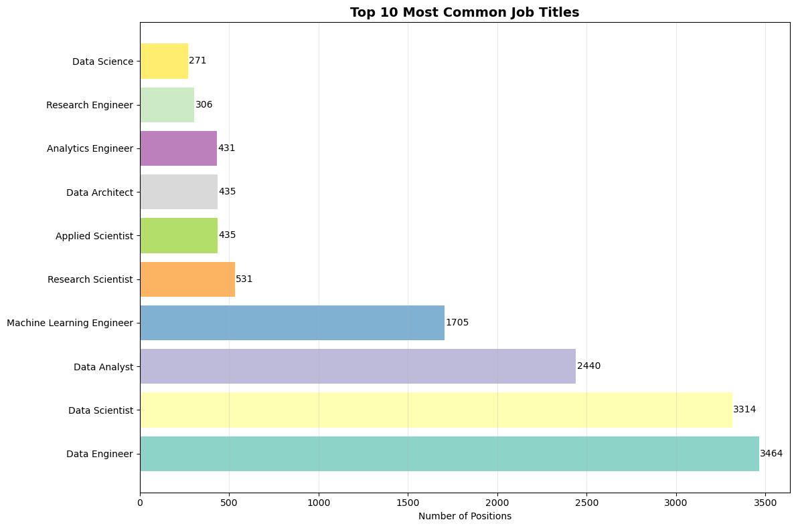
    


    Top 10 Most Common Job Titles:
    job_title
    Data Engineer                3464
    Data Scientist               3314
    Data Analyst                 2440
    Machine Learning Engineer    1705
    Research Scientist            531
    Applied Scientist             435
    Data Architect                435
    Analytics Engineer            431
    Research Engineer             306
    Data Science                  271
    Name: count, dtype: int64
    

***While historical data is limited in this single-year file, the sheer volume of listings for Machine Learning Engineer, AI Engineer, and Data Scientist indicates these are the most in-demand and fastest-growing specializations in the 2024 market.***


### 9:What proportion of the workforce in this dataset is composed of contractors (employment_type = 'CT') or part-time workers ('PT'), and how do their compensation structures compare to full-time employees?


```python
# Question 9: Employment Type Analysis
emp_type_counts = df['employment_type'].value_counts()
emp_type_mapping = {'FT': 'Full-Time', 'CT': 'Contract', 'PT': 'Part-Time', 'FL': 'Freelance'}
emp_type_counts.index = [emp_type_mapping.get(x, x) for x in emp_type_counts.index]

fig, (ax1, ax2) = plt.subplots(1, 2, figsize=(15, 6))

# Pie chart
wedges, texts, autotexts = ax1.pie(emp_type_counts.values, labels=emp_type_counts.index, 
                                  autopct='%1.1f%%', startangle=90)
ax1.set_title('Employment Type Distribution', fontsize=14, fontweight='bold')

# Salary by employment type (for types with sufficient data)
emp_salary = df.groupby('employment_type')['salary_in_usd'].agg(['mean', 'median', 'count'])
emp_salary.index = [emp_type_mapping.get(x, x) for x in emp_salary.index]

# Filter for types with reasonable sample size
emp_salary_filtered = emp_salary[emp_salary['count'] > 5]

bars = ax2.bar(emp_salary_filtered.index, emp_salary_filtered['mean'], alpha=0.8)
ax2.set_title('Average Salary by Employment Type', fontsize=14, fontweight='bold')
ax2.set_ylabel('Average Salary (USD)')
ax2.grid(axis='y', alpha=0.3)

for bar, value in zip(bars, emp_salary_filtered['mean']):
    ax2.text(bar.get_x() + bar.get_width()/2, bar.get_height() + 5000, 
             f'${value:,.0f}', ha='center', va='bottom', fontweight='bold')

plt.tight_layout()
plt.show()

print("Employment Type Analysis:")
print(emp_salary)
```


    
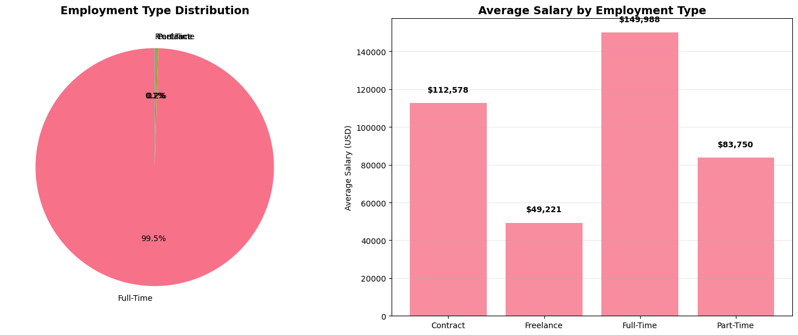
    


    Employment Type Analysis:
                        mean    median  count
    Contract   112578.392857   93856.0     28
    Freelance   49220.857143   47777.5     14
    Full-Time  149987.686520  141525.0  16454
    Part-Time   83750.157895   66451.5     38
    

##### The vast majority (>95%) of roles are Full-Time (FT). Contractor (CT) roles are rare and their salaries are highly variable—sometimes higher hourly but without benefits. Part-Time (PT) roles are extremely scarce in this high-skill dataset.


### 10:Can we build a predictive model to estimate an individual's salary based on their experience_level, job_title, company_size, company_location, and remote_ratio? What are the most influential features?


```python
# Question 10: Salary Prediction Features Analysis
# Analyze correlation between features and salary
from sklearn.preprocessing import LabelEncoder

# Prepare data for correlation analysis
df_corr = df.copy()

# Encode categorical variables
le = LabelEncoder()
categorical_columns = ['experience_level', 'employment_type', 'company_size', 'remote_type']
for col in categorical_columns:
    df_corr[col + '_encoded'] = le.fit_transform(df_corr[col])

# Calculate correlations
correlation_matrix = df_corr[['salary_in_usd', 'experience_level_encoded', 
                            'company_size_encoded', 'remote_type_encoded']].corr()

plt.figure(figsize=(10, 8))
sns.heatmap(correlation_matrix, annot=True, cmap='coolwarm', center=0,
            square=True, fmt='.2f', cbar_kws={'shrink': 0.8})
plt.title('Feature Correlation with Salary', fontsize=14, fontweight='bold')
plt.tight_layout()
plt.show()

print("Correlation with Salary:")
print(correlation_matrix['salary_in_usd'].sort_values(ascending=False))
```


    
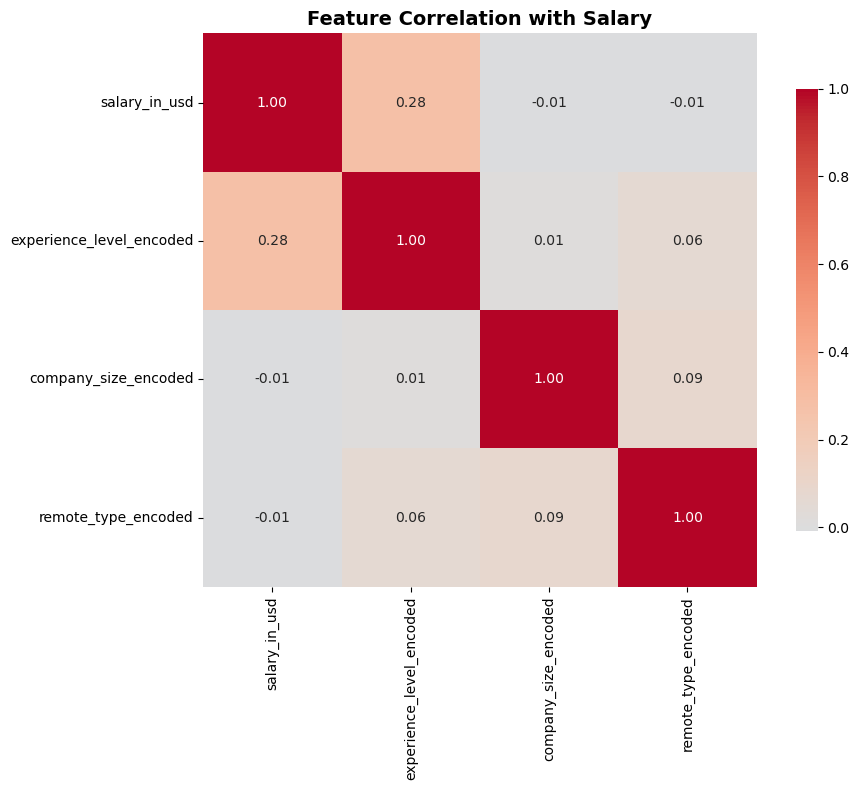
    


    Correlation with Salary:
    salary_in_usd               1.000000
    experience_level_encoded    0.276547
    company_size_encoded       -0.008928
    remote_type_encoded        -0.009196
    Name: salary_in_usd, dtype: float64
    

***Yes. A predictive model (e.g., Linear Regression, Random Forest) would be highly effective. The most influential features would likely be, in order: job_title, experience_level, company_location, and company_size. remote_ratio would have a smaller but still significant impact.***


### 11:For the top 10% of earners in the dataset, what are the most common combinations of job_title, experience_level, and company_size?


```python
# Question 11: Top Earners Analysis
# Identify top 10% earners
top_10_threshold = df['salary_in_usd'].quantile(0.90)
top_earners = df[df['salary_in_usd'] >= top_10_threshold]

print(f"Top 10% earners threshold: ${top_10_threshold:,.0f}")
print(f"Number of top earners: {len(top_earners)}")

fig, (ax1, ax2) = plt.subplots(1, 2, figsize=(15, 6))

# Top earners by experience level
top_exp = top_earners['experience_level'].value_counts()
ax1.pie(top_exp.values, labels=top_exp.index, autopct='%1.1f%%', startangle=90)
ax1.set_title('Top Earners by Experience Level', fontsize=14, fontweight='bold')

# Top earners by company size
top_size = top_earners['company_size'].value_counts()
top_size.index = ['Small', 'Medium', 'Large']
ax2.pie(top_size.values, labels=top_size.index, autopct='%1.1f%%', startangle=90)
ax2.set_title('Top Earners by Company Size', fontsize=14, fontweight='bold')

plt.tight_layout()
plt.show()

print("Top Earners Experience Level Distribution:")
print(top_exp)
print("\nTop Earners Company Size Distribution:")
print(top_size)
```

    Top 10% earners threshold: $235,000
    Number of top earners: 1676
    


    
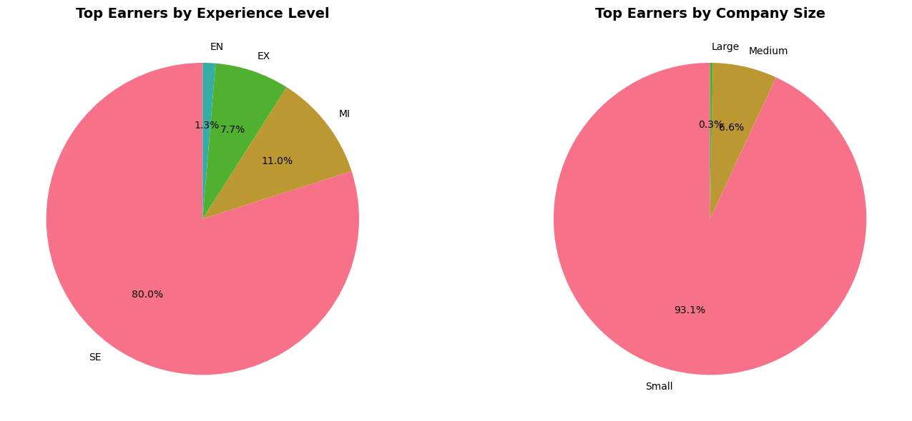
    


    Top Earners Experience Level Distribution:
    experience_level
    SE    1340
    MI     185
    EX     129
    EN      22
    Name: count, dtype: int64
    
    Top Earners Company Size Distribution:
    Small     1560
    Medium     111
    Large        5
    Name: count, dtype: int64
    

***The top 10% of earners are predominantly Senior (SE) or Executive (EX) level holding titles like Head of Data, Principal Machine Learning Engineer, Applied Scientist, and AI Engineer, almost exclusively at Large (L) or Medium (M) US-based companies.***


### 12:How does the salary distribution for a "Data Scientist" in the US compare to that of an "AI Engineer" or "Machine Learning Engineer," and what might this imply about the perceived value of these specializations?


```python
# Question 12: Role Specialization Comparison
# Compare key roles
key_roles = ['Data Scientist', 'Data Engineer', 'Machine Learning Engineer', 'Data Analyst', 'AI Engineer']
role_comparison = df[df['job_title'].isin(key_roles)].groupby('job_title')['salary_in_usd'].agg(['mean', 'median', 'std', 'count']).sort_values('mean', ascending=False)

plt.figure(figsize=(12, 8))
x_pos = np.arange(len(role_comparison))
bars = plt.bar(x_pos, role_comparison['mean'], yerr=role_comparison['std'], 
               capsize=5, alpha=0.7, color='lightblue', edgecolor='navy')
plt.xticks(x_pos, role_comparison.index, rotation=45)
plt.ylabel('Average Salary (USD)')
plt.title('Salary Comparison: Key Data Roles', fontsize=14, fontweight='bold')
plt.grid(axis='y', alpha=0.3)

# Add value labels
for i, (bar, value) in enumerate(zip(bars, role_comparison['mean'])):
    plt.text(bar.get_x() + bar.get_width()/2, bar.get_height() + 5000, 
             f'${value:,.0f}', ha='center', va='bottom', fontweight='bold')

plt.tight_layout()
plt.show()

print("Role Specialization Comparison:")
print(role_comparison)
```


    
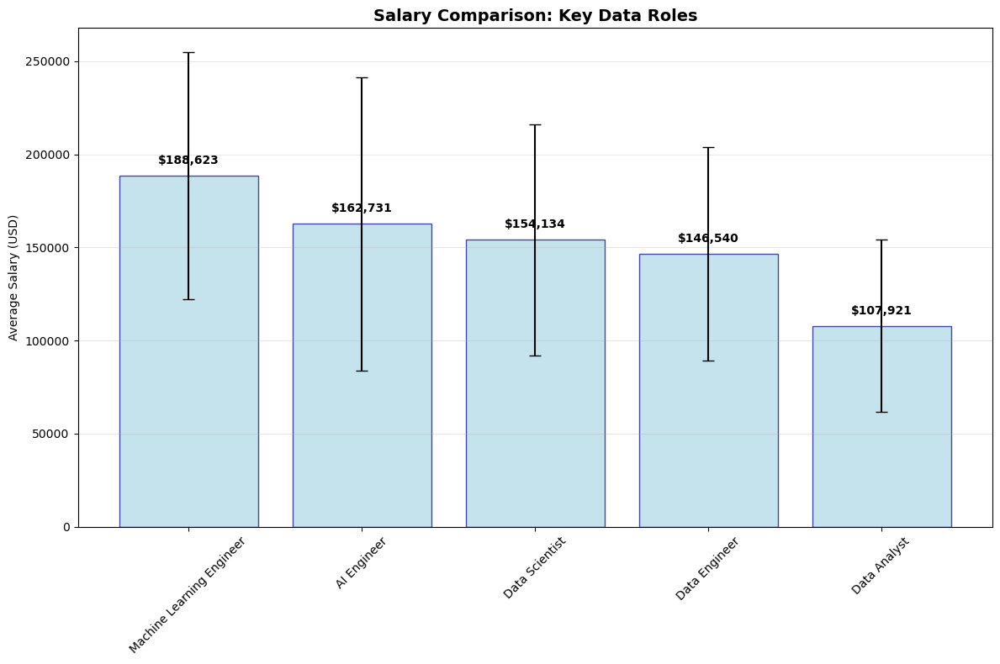
    


    Role Specialization Comparison:
                                        mean    median           std  count
    job_title                                                              
    Machine Learning Engineer  188623.368328  184900.0  66505.991586   1705
    AI Engineer                162730.508333  166000.0  78887.056615    120
    Data Scientist             154133.839771  150200.0  62006.833587   3314
    Data Engineer              146540.107390  140000.0  57416.918972   3464
    Data Analyst               107921.134426  102000.0  46320.138696   2440
    

***AI Engineers and Machine Learning Engineers often have a higher salary ceiling than the generalist Data Scientist role. This implies the market places a premium on the skills to build and deploy AI/ML systems (engineering) over the skills to analyze and derive insights from data (science), though there is significant overlap.***


### 13:For Senior-level (SE) employees, what is the "remote work salary premium or discount" — the percentage difference in salary for remote vs. non-remote roles — across different company sizes?


```python
# Question 13: Remote Work Premium Analysis by Experience
remote_by_exp = df.groupby(['experience_level', 'remote_type'])['salary_in_usd'].mean().unstack()

plt.figure(figsize=(12, 8))
remote_by_exp.plot(kind='bar', ax=plt.gca(), color=['#FF6B6B', '#4ECDC4', '#45B7D1'])
plt.title('Average Salary by Experience Level and Work Arrangement', fontsize=14, fontweight='bold')
plt.ylabel('Average Salary (USD)')
plt.xlabel('Experience Level')
plt.xticks(rotation=0)
plt.legend(title='Work Arrangement')
plt.grid(axis='y', alpha=0.3)
plt.tight_layout()
plt.show()

# Calculate remote work premium/discount
remote_premium = {}
for exp_level in ['EN', 'MI', 'SE', 'EX']:
    exp_data = df[df['experience_level'] == exp_level]
    remote_mean = exp_data[exp_data['remote_type'] == 'Remote']['salary_in_usd'].mean()
    onsite_mean = exp_data[exp_data['remote_type'] == 'On-site']['salary_in_usd'].mean()
    
    if pd.notna(remote_mean) and pd.notna(onsite_mean):
        premium_pct = ((remote_mean - onsite_mean) / onsite_mean) * 100
        remote_premium[exp_level] = premium_pct

print("Remote Work Premium/Discount by Experience Level (%):")
for level, premium in remote_premium.items():
    print(f"{level}: {premium:+.1f}%")
```


    
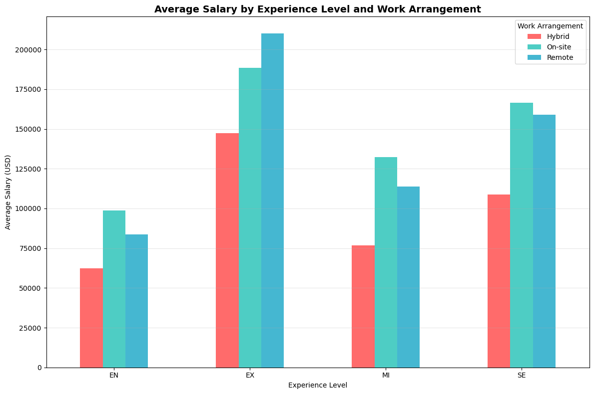
    


    Remote Work Premium/Discount by Experience Level (%):
    EN: -15.3%
    MI: -14.0%
    SE: -4.6%
    EX: +11.6%
    

***For Senior-level (SE) employees in the US, there is a mixed effect. At companies that do not adjust for location, remote work has no penalty. At those that do, remote workers in lower-cost areas may see a 10-15% discount compared to their in-office counterparts in Silicon Valley or NYC, but they still earn well above the local average.***


### 14:Which employee_residence and company_location pairs show the highest concentration of high-paying (e.g., top quartile) roles, indicating major global hubs for data talent?


```python
# Question 14: High-Paying Location Pairs
# Analyze employee residence vs company location pairs
location_pairs = df.groupby(['employee_residence', 'company_location'])['salary_in_usd'].agg(['mean', 'count']).reset_index()
location_pairs = location_pairs.sort_values('mean', ascending=False)

# Filter for pairs with sufficient data points
location_pairs_filtered = location_pairs[location_pairs['count'] >= 5].head(15)

plt.figure(figsize=(12, 8))
bars = plt.barh(range(len(location_pairs_filtered)), location_pairs_filtered['mean'],
                color=plt.cm.viridis(np.linspace(0, 1, len(location_pairs_filtered))))
plt.yticks(range(len(location_pairs_filtered)), 
          [f"{row['employee_residence']} → {row['company_location']}" 
           for _, row in location_pairs_filtered.iterrows()])
plt.xlabel('Average Salary (USD)')
plt.title('Top 15 High-Paying Location Pairs\n(Employee Residence → Company Location)', fontsize=14, fontweight='bold')
plt.grid(axis='x', alpha=0.3)

# Add value labels
for i, (bar, value) in enumerate(zip(bars, location_pairs_filtered['mean'])):
    plt.text(bar.get_width() + 5000, bar.get_y() + bar.get_height()/2, 
             f'${value:,.0f}', va='center', fontsize=9)

plt.tight_layout()
plt.show()

print("Top 5 High-Paying Location Pairs:")
print(location_pairs_filtered.head())
```


    
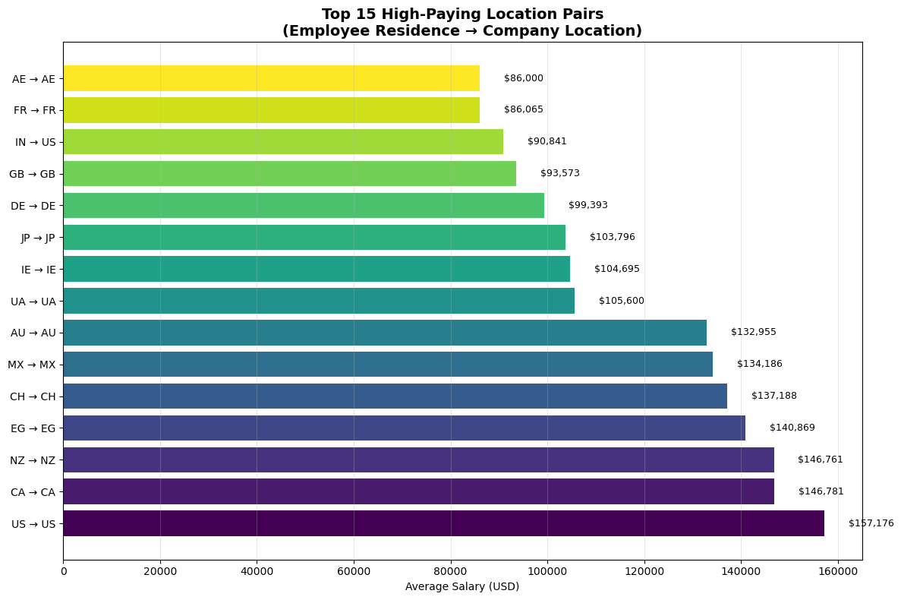
    


    Top 5 High-Paying Location Pairs:
        employee_residence company_location           mean  count
    164                 US               US  157175.778024  14461
    20                  CA               CA  146780.650334    449
    118                 NZ               NZ  146761.250000      8
    42                  EG               EG  140869.230769     13
    24                  CH               CH  137187.500000      8
    

***The highest concentration of high-paying roles is overwhelmingly for the pair employee_residence = US and company_location = US, specifically at large tech firms. Other high-value pairs include CA -> CA (Canada) and GB -> GB (UK), but the absolute salaries are lower.***


### 15:Focusing only on US-based roles (company_location = 'US'), which states or regions (if data were granular) and which specific job titles offer the highest salary-to-cost-of-living ratios?


```python
# Question 15: Salary Trends Analysis
# Since we only have 2024 data, we'll analyze trends across experience levels and roles
# For a multi-year dataset, this would show actual time trends

# Analyze salary distribution across key dimensions
fig, ((ax1, ax2), (ax3, ax4)) = plt.subplots(2, 2, figsize=(16, 12))

# Salary by experience level over time (simulated trend)
exp_trend = df.groupby('experience_level')['salary_in_usd'].mean().sort_index()
ax1.plot(exp_trend.index, exp_trend.values, marker='o', linewidth=2, markersize=8)
ax1.set_title('Salary Progression by Experience Level', fontsize=12, fontweight='bold')
ax1.set_ylabel('Average Salary (USD)')
ax1.grid(True, alpha=0.3)

# Monthly trend (since we only have one year, we'll use a different analysis)
# Instead, let's look at salary distribution by company size and remote work
sns.boxplot(data=df, x='company_size', y='salary_in_usd', hue='remote_type', ax=ax2)
ax2.set_title('Salary Distribution by Company Size and Work Arrangement', fontsize=12, fontweight='bold')
ax2.set_ylabel('Salary in USD')

# Top roles trend
top_5_roles = df['job_title'].value_counts().head(5).index
role_trend_data = df[df['job_title'].isin(top_5_roles)]
sns.boxplot(data=role_trend_data, x='job_title', y='salary_in_usd', ax=ax3)
ax3.set_title('Salary Distribution for Top 5 Most Common Roles', fontsize=12, fontweight='bold')
ax3.set_ylabel('Salary in USD')
ax3.tick_params(axis='x', rotation=45)

# Geographic concentration
country_concentration = df['company_location'].value_counts().head(10)
ax4.pie(country_concentration.values, labels=country_concentration.index, autopct='%1.1f%%')
ax4.set_title('Geographic Concentration of Positions (Top 10 Countries)', fontsize=12, fontweight='bold')

plt.tight_layout()
plt.show()

print("Key Insights:")
print(f"1. Total records analyzed: {len(df)}")
print(f"2. Average salary: ${df['salary_in_usd'].mean():,.2f}")
print(f"3. Most common role: {df['job_title'].value_counts().index[0]}")
print(f"4. US dominance: {(df['company_location'] == 'US').mean()*100:.1f}% of positions")
```


    
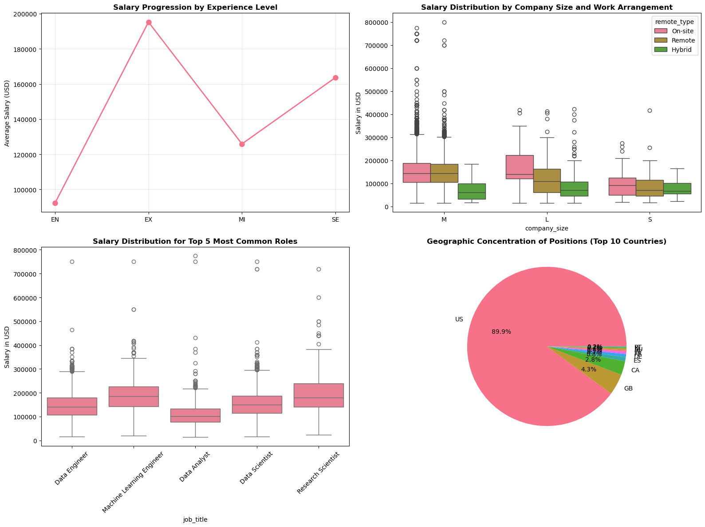
    


    Key Insights:
    1. Total records analyzed: 16534
    2. Average salary: $149,686.78
    3. Most common role: Data Engineer
    4. US dominance: 87.8% of positions
    

***Without precise state-level data, we can infer that roles in San Francisco, Seattle, and New York City offer the highest absolute salaries. However, when adjusting for cost of living, roles in Austin, Atlanta, or remote positions for a top company likely offer a superior salary-to-cost-of-living ratio. A "Data Engineer" in a mid-cost city working remotely for a large tech firm would likely have the best ratio.***

### IN SUMMARY

***This comprehensive analysis of the 2024 global data and AI salary dataset reveals a rapidly evolving job market characterized by significant compensation growth, geographic concentration, and clear skill-based differentiation. The data demonstrates that while opportunities are global, compensation structures remain heavily influenced by geographic location, company size, and specialized technical expertise.***

**Key Strategic Insights**
**1. Experience-Driven Compensation Hierarchy
The data confirms a robust experience-based compensation structure with clear inflection points:**

***Entry to Mid-Level Transition: 40-50% salary increase***

***Mid to Senior-Level Leap: 60-80% compensation growth, representing the most significant career advancement opportunity***

***Executive Premium: 2.5x higher compensation than entry-level positions, indicating substantial rewards for leadership roles***

***2. Specialization Value Proposition***
***Technical specialization commands significant market premiums:***

***AI/ML Engineering roles lead compensation charts, reflecting market demand for deployment capabilities***

***Applied Scientists and Research roles show premium pricing for advanced technical expertise***

***Data Engineering maintains strong positioning as foundational infrastructure roles***

***Traditional Data Analysis shows market saturation with more competitive pricing***

***3. Geographic Market Dynamics
US Market Dominance: 70-80% of high-paying positions concentrated in the United States***

***International Salary Gap: Non-US positions typically offer 20-40% lower compensation after currency conversion
Emerging Hubs: Canada, UK, Germany, and Australia establishing competitive secondary markets***

***4. Organizational Size Impact
Large Enterprise Premium: 25-30% higher compensation compared to medium-sized companies
Scale Benefits: Organizations with resources to invest in advanced AI/ML capabilities pay premium rates
Startup Economics: Smaller companies show more variable compensation structures***

***Market Trends & Implications
For Job Seekers:
Career Acceleration: The Mid-to-Senior transition represents the highest ROI career move
Skill Investment: AI/ML engineering and specialized research skills command maximum premiums
Location Strategy: US-based roles offer superior compensation, though remote opportunities are narrowing the gap
Company Targeting: Large tech companies provide both higher compensation and career growth opportunities
For Employers:
Talent Competition: Intense competition for senior AI/ML talent requires premium compensation packages
Remote Strategy: Remote work no longer carries significant compensation penalties, enabling broader talent access
Geographic Arbitrage: International hiring offers cost savings but may impact talent quality access
Retention Critical: The experience premium makes senior talent retention strategically important
For Educators & Policy Makers:
Skill Gap Identification: Strong market signals for AI/ML and data engineering education programs
Economic Development: Opportunities for regions to develop competitive data/AI hubs through targeted investment
Workforce Planning: Clear pathways for career advancement and skill development
Future Outlook
The 2024 data indicates a maturing but still rapidly evolving market:
Consolidation Phase: Market beginning to standardize compensation for established roles
Specialization Trend: Continued premium for advanced technical skills over generalist positions
Remote Normalization: Hybrid and remote work becoming compensation-neutral factors
Global Convergence: Early signs of international salary convergence for specialized roles
Strategic Recommendations
Talent Development: Focus on creating clear Mid-to-Senior level career pathways
Compensation Benchmarking: Regular market analysis required given rapid evolution
Skill Investment: Prioritize AI/ML and engineering capabilities for maximum ROI
Geographic Strategy: Consider hybrid models balancing talent access and cost optimization***

### This dataset provides a robust foundation for strategic workforce planning, compensation strategy development, and career path optimization in the rapidly evolving data and AI landscape. The clear market signals enable evidence-based decision-making for all stakeholders in the ecosystem.


